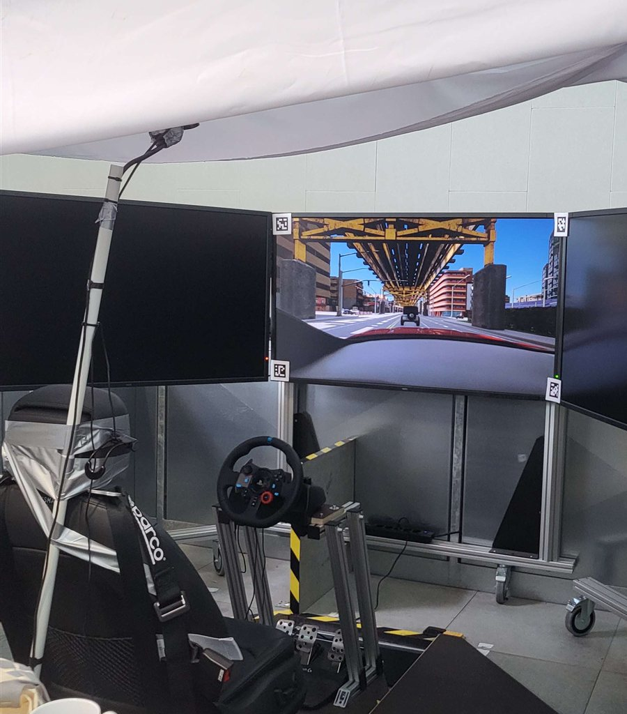

# EchoDrive

EchoDrive is a gamified in-cabin system prototype designed to support situational awareness during automated (SAE Level 3) driving through spatialized audio cues and gesture-based responses. Built on CARLA 0.9.13, it implements an echolocation-inspired "call-and-answer" loop: the driver triggers a sonar-like scan, the nearest road user within 15 m (car, pedestrian, or cyclist) answers with a spatialized sound cue from its direction, and the driver points toward the perceived direction with a pointing index finger hand gesture tracked via webcam (MediaPipe). Correct gestures yield +5 points, errors −3, with live score feedback on the HUD. At scripted moments the system issues takeover requests (TORs), and reaction times to press the red TOR Accept Button (on the wheel) are logged. This prototype's study data is written to semicolon-separated CSV files.

> **Archived artifact:** *[add Zenodo/OSF DOI when build available]*

## Study conditions

The launcher asks for a participant ID and one of three scenarios:

| Scenario | Description | Route | Takeover requests |
|---|---|---|---|
| `BASE` | Baseline condition — the script runs the automated drive and TORs while the participant performs a visual smartphone NDRT; no echolocation game | `route_29.xml` | 7 within ~10 min |
| `ECHO` | Drive with the echolocation game active | `route_20.xml` | 7 within ~10 min |
| `TRIAL` | Short familiarization/practice drive with the game active | `route_tutorial.xml` | 1 (after 3 min) |

In every condition the ego vehicle drives autonomously (CARLA autopilot); participants respond to TORs by pressing <kbd>Enter</kbd> within a 5-second window.

## Requirements

### Hardware



- Windows 10/11 PC able to run CARLA 0.9.13 (dedicated GPU with 6+ GB VRAM recommended, ~20 GB free disk space)
- Webcam (used at OpenCV device index `0`) for hand-gesture tracking — mounted overhead and pointing down in the study setup
- Stereo audio output — study setup used: Stereo Headphones from Audio-Technica ATH-A550Z (rendering via OpenAL)
- Keyboard, or any input device that emits the <kbd>Space</kbd> and <kbd>Enter</kbd> keystrokes (study setup: a Logitech G29 steering wheel with a wheel-mounted scan button and a red TOR button mapped to these keys)

<br clear="right">

### Software

- **CARLA 0.9.13** — [download](https://github.com/carla-simulator/carla/blob/master/Docs/download.md) (tested with the packaged Windows release)
- **Python 3.7 (64-bit)** — e.g. [3.7.9](https://www.python.org/downloads/release/python-379/). Python 3.7 specifically is required: the `carla==0.9.13` and bundled MediaPipe wheels are built for it.
- All Python dependencies are pinned in [`requirements.txt`](requirements.txt). The MediaPipe wheel (`mediapipe-0.8.11-cp37-cp37m-win_amd64.whl`) is included in the repository, so no external downloads beyond PyPI are needed.

## Installation

1. Install CARLA 0.9.13 by extracting the packaged release, e.g. to `C:\CARLA_0.9.13\` (the folder containing `CarlaUE4.exe`).

2. Clone this repository **into the CARLA root folder**, so that the scripts sit next to `CarlaUE4.exe`:

   ```bat
   cd C:\CARLA_0.9.13
   git clone https://github.com/Molu15/EchoDrive.git EchoDrive
   xcopy /E /Y EchoDrive\* .
   ```

   The scripts must live in the CARLA root because they reference CARLA's `PythonAPI\util\config.py` relative to their own location.

3. Create a Python 3.7 virtual environment and install the pinned dependencies:

   ```bat
   py -3.7 -m venv venv
   venv\Scripts\activate
   python -m pip install --upgrade pip
   pip install -r requirements.txt
   ```

## Running the study

1. Start the simulator: double-click `CarlaUE4.exe` (or run it from a terminal) and wait until the world has loaded.

2. In a second terminal (with the virtual environment activated), from the CARLA root folder:

   ```bat
   python start_carla.py
   ```

3. Follow the prompts: enter a participant ID (e.g. `P01`, `abc`, `test` etc.) and a scenario (`BASE`, `ECHO`, or `TRIAL`).

The launcher then starts CARLA's ScenarioRunner with the matching route, spawns the ego vehicle with autopilot, disables server-side rendering for performance, and starts the game/audio logic and the takeover schedule.

### Controls (participant)

| Key | Action |
|---|---|
| <kbd>Space</kbd> | Emit an echolocation ping (`ECHO`/`TRIAL` only) |
| <kbd>Enter</kbd> | Respond to a takeover request (all conditions) |
| Hand gesture (webcam) | Point toward the direction of the sound source in the webcam FOV after a ping |

Note: keyboard input is captured globally via the `keyboard` package, so the simulator window does not need focus. This is also why wheel-mounted buttons (as in the study) work — they only need to be mapped to the <kbd>Space</kbd>/<kbd>Enter</kbd> keystrokes, e.g. with Logitech G HUB.

## Output data

Each run writes semicolon-separated (`;`) CSV files to `CSVLogs\` (created automatically in the project root), named:

```
<participantID>_<scenario>_<logName>_<YYYY-MM-DD_HH-MM-SS>.csv
```

| Log | Written by | Columns |
|---|---|---|
| `TORLog` | `takeover_manager.py` | `timestamp_initiation`, `timestamp_reaction`, `reaction_time`, `successful_tor` |
| `echoLog` | `echolocation_game.py` | `timestamp_inputTap`, `result_echowave`, `gesturedetect_1round`, `gesturedetect_2round` |
| `gestureLog` | `gesture_manager.py` | `timestamp_initGestureTime`, `timestamp_inputGestureTime`, `gesture_reactTime`, `angle_preciseGesture`, `angle_gesture`, `angle_object`, `angle_deviation`, `matched_objAngle` |
| `scoreLog` | `score_tracker.py` | `num_ObjEcholocations`, `score_total`, `correct_direction` |

Timestamps are Unix epoch seconds; angles are in degrees; reaction times are in seconds.

## Repository structure

| Path | Purpose |
|---|---|
| `start_carla.py` | **Main entry point** — experiment launcher (participant ID, condition, TOR schedule) |
| `main_game.py` | Orchestrates the `ECHO`/`TRIAL` condition (game + managers) |
| `echolocation_game.py` | Echolocation condition game loop (ping → sound cue → gesture answer) |
| `base_game.py` | `BASE` condition: simulation and TOR alerts only |
| `audio_manager.py` | Spatialized sound cues (OpenAL) |
| `get_answer.py` | OpenAL listener setup and positional tone playback |
| `gesture_manager.py` | Webcam hand tracking and pointing-angle detection (MediaPipe) |
| `rss_manager.py` | Finds the nearest relevant road user around the ego vehicle |
| `takeover_manager.py` | Schedules TORs, records reaction times |
| `trigger_manager.py` | Global keyboard input (`keyboard` package) |
| `score_tracker.py` | In-game score tracking |
| `csv_logger.py` | CSV logging backend (all logs) |
| `shared_audio_state.py` | Shared state for active OpenAL sources |
| `scenario_runner.py`, `srunner/` | CARLA ScenarioRunner 0.9.13 (bundled, lightly modified) |
| `scenario_runner_manual_control.py` | CARLA manual-control client (modified: HUD, autopilot, ego handling) |
| `agents/` | CARLA PythonAPI navigation agents (bundled) |
| `route_20.xml`, `route_29.xml`, `route_tutorial.xml` | Study routes in CARLA's Town 03 Map(ScenarioRunner route format) |

## Known issues & troubleshooting

- **Webcam index:** the webcam is opened at device index `0` (`gesture_manager.py`). If the wrong camera is used on a multi-camera machine, change the index in `cv2.VideoCapture(0)`.
- **Port 2000 blocked / CARLA not ready:** the launcher waits up to 60 s for the simulator. If it never becomes ready, check for stale processes: `netstat -aon | findstr :2000`, then `taskkill /PID <pid> /F`.
- **Global keyboard hook:** the `keyboard` package may require an elevated (administrator) terminal on some systems.
